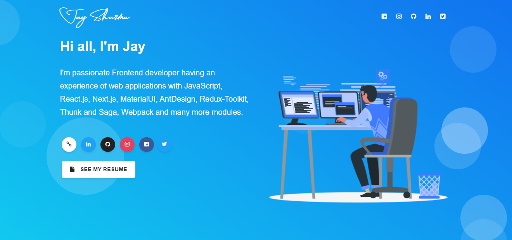

<h1 align="center">Welcome to My Portfolio 👋</h1>

My Portfolio is built with React.js | Bootstrap that helps me showcase my work, skills and Experience as a software developer.

  <kbd>
    
  </kbd>

## To view a live example, **[click here](https://sharmajay.netlify.app)**.

## Sections

✔️ Summary and About me\
✔️ Skills\
✔️ Education\
✔️ Work Experience\
✔️ Feedbacks\
✔️ Projects\
✔️ Github Profile

👤 **Jay Sharma**

- Website: https://sharmajay.netlify.app
- Github: [@JAY9039](https://github.com/JAY9039)
- LinkedIn: [@j-shharma](https://www.linkedin.com/in/j-shharma/)

**Made with ♥ by** [Jay Sharma](https://www.linkedin.com/in/j-shharma/)
